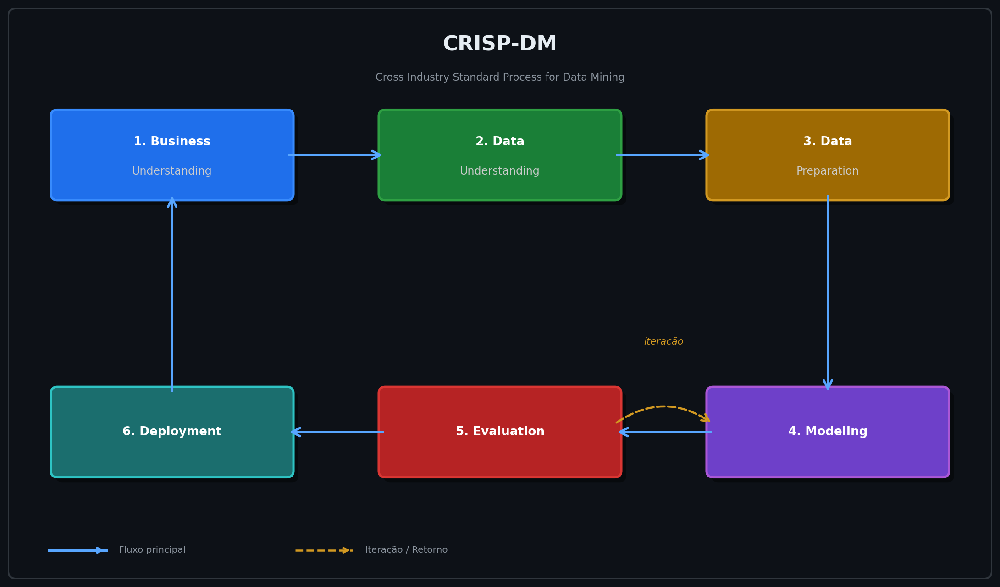

<div align="center">

# ⚖️ Justiça Preditiva: Auditoria e Mitigação de Viés Racial no Algoritmo COMPAS

<p align="center">
  
  
  
  
  
</p>

<p align="center">
  
  
</p>

<br/>

> *"É matematicamente impossível satisfazer simultaneamente a paridade preditiva e a igualdade nas taxas de erro quando as taxas de base diferem entre grupos. Isso não é uma falha de um modelo específico. É uma propriedade inerente da estatística."*

<br/>

</div>

---

## 📌 Sumário

- [Visão Geral](#-visão-geral)
- [Contexto e Motivação](#-contexto-e-motivação)
- [Metodologia CRISP-DM](#-metodologia-crisp-dm)
- [Estrutura do Projeto](#-estrutura-do-projeto)
- [O Debate Central: Duas Definições de Justiça](#-o-debate-central-duas-definições-de-justiça)
- [Dados](#-dados)
- [Modelagem e Mitigação](#-modelagem-e-mitigação)
- [Principais Resultados](#-principais-resultados)
- [Stack Tecnológica](#-stack-tecnológica)
- [Como Executar](#-como-executar)
- [Limitações e Reflexões Éticas](#-limitações-e-reflexões-éticas)
- [Referências](#-referências)
- [Autor](#-autor)

---

## 🔭 Visão Geral

Este projeto conduz uma **auditoria completa de viés racial** no algoritmo **COMPAS** (*Correctional Offender Management Profiling for Alternative Sanctions*) — uma ferramenta comercial usada por juízes norte-americanos para estimar a probabilidade de reincidência criminal de réus.

A investigação replica os achados do estudo *"Machine Bias"* da ProPublica (2016), vai além com modelagem própria usando XGBoost, aplica técnicas modernas de mitigação com Fairlearn e explica o comportamento dos modelos via SHAP Values — tornando explícitas as trocas (*trade-offs*) inevitáveis entre acurácia e justiça algorítmica.

**Este não é um projeto de maximização de acurácia.** É uma auditoria sociotécnica que usa a modelagem como instrumento de investigação.

---

## 🧭 Contexto e Motivação

O COMPAS é usado por juízes e agentes de liberdade condicional em vários estados americanos. Em 2016, a ProPublica publicou uma investigação revelando padrões preocupantes de erro desigual:

| Achado | Réus Negros | Réus Brancos |
|:---|:---:|:---:|
| Classificados erroneamente como **alto risco** (não reincidiram) | **45%** | 23% |
| Classificados erroneamente como **baixo risco** (reincidiram) | 28% | **48%** |
| Probabilidade de receber escore mais alto (controlando por outros fatores) | **45% maior** | — |

A Northpointe (criadora do COMPAS) respondeu que o algoritmo é *calibrado* — ou seja, um escore de risco "7" corresponde à mesma probabilidade de reincidência independentemente da raça. Ambas as partes têm razão dentro de suas próprias definições de justiça. Esse é o paradoxo central investigado aqui.

---

## 🔄 Metodologia CRISP-DM

O projeto segue rigorosamente o **CRISP-DM** (*Cross Industry Standard Process for Data Mining*), evidenciando cada fase no notebook:



| Fase | Seção do Notebook | Descrição |
|:---|:---|:---|
| **Business Understanding** | Seção 1 | Definição do problema, objetivos e critérios de sucesso |
| **Data Understanding** | Seção 2 | Coleta, EDA e análise das disparidades nos dados brutos |
| **Data Preparation** | Seção 3 | Limpeza (metodologia ProPublica), encoding e divisão treino/teste |
| **Modeling** | Seção 4 | Treinamento do modelo base (XGBoost) e modelo mitigado (Fairlearn) |
| **Evaluation** | Seção 5 | Comparação de métricas de justiça entre modelos por grupo racial |
| **Deployment / Explainability** | Seção 6 | Análise SHAP: importância de features e detecção de viés residual |

> **Natureza iterativa:** Os achados da fase de Avaliação retroalimentaram a Modelagem em múltiplos ciclos — cada estratégia de mitigação testada gerou um novo ciclo de avaliação, tornando os *trade-offs* explícitos e documentados.

---

## 📁 Estrutura do Projeto

```
analise-vies-racial-compas/
│
├── 📁 notebooks
│    └──📓 auditoria_mitigação_vies_racial_COMPAS.ipynb   # Notebook principal
│
│
├── 📁 figures
│    ├── fig01.png   # Distribuição dos escores de risco por raça
│    ├── fig02.png   # Taxas de reincidência por grupo racial
│    ├── fig03.png   # Distribuição de antecedentes criminais (boxplot)
│    ├── fig04.png   # SHAP Beeswarm — importância global das features
│    ├── fig05.png   # SHAP Dependence Plot — interação raça × antecedentes
│    ├── fig06.png   # SHAP Bar Plot — ranking de importância
│    └── fig07.png   # Análise comparativa de viés por grupo racial
│
└── 📄 README.md
```

---

## ⚖️ O Debate Central: Duas Definições de Justiça

```
        Posição da ProPublica              Posição da Northpointe
        ──────────────────────             ──────────────────────
        "Igualdade de Erros"               "Paridade Preditiva"

        FPR(negros) ≈ FPR(brancos)         P(Y=1|Ŷ=1, raça=A) ≈
        FNR(negros) ≈ FNR(brancos)         P(Y=1|Ŷ=1, raça=B)

              ↕  matematicamente incompatíveis quando
                 as taxas de base diferem entre grupos
                       (Chouldechova, 2017)
```

**A impossibilidade matemática:** Quando as taxas de reincidência diferem entre grupos (≈51% para negros vs. ≈39% para brancos neste dataset), é **provadamente impossível** satisfazer simultaneamente a paridade preditiva e a igualdade de taxas de erro. Escolher uma métrica de justiça é, portanto, uma decisão ética — não apenas técnica.

Este projeto não busca *o* modelo justo. Apresenta um portfólio de modelos, cada um otimizado para uma definição diferente de justiça, tornando essas trocas explícitas e auditáveis.

---

## 📦 Dados

**Fonte:** [ProPublica COMPAS Analysis](https://github.com/propublica/compas-analysis)

- **Origem:** Registros criminais do Condado de Broward, Flórida (2013–2014)
- **Tamanho original:** ~10.000 réus criminais
- **Variável alvo:** `two_year_recid` — nova prisão em até 2 anos após a avaliação

### Variáveis-chave

| Variável | Tipo | Descrição |
|:---|:---|:---|
| `age` | inteiro | Idade do réu na avaliação |
| `race` | categórica | Raça (atributo protegido primário) |
| `sex` | categórica | Sexo (atributo protegido secundário) |
| `priors_count` | inteiro | Número de antecedentes criminais |
| `c_charge_degree` | categórica | Gravidade da acusação (Felony / Misdemeanor) |
| `juv_fel_count` | inteiro | Crimes juvenis graves |
| `decile_score` | inteiro | Escore original do COMPAS (1–10) |
| `two_year_recid` | binária | **Variável alvo:** reincidência em 2 anos |

### Filtragem aplicada (metodologia ProPublica)

```python
df_clean = df[
    (df['days_b_screening_arrest'] <= 30) &   # Janela temporal de 30 dias
    (df['days_b_screening_arrest'] >= -30) &
    (df['is_recid'] != -1) &                  # Registros válidos
    (df['c_charge_degree'] != "O") &          # Remove infrações de trânsito
    (df['score_text'] != 'N/A')               # Remove avaliações incompletas
]
```

> ⚠️ **Limitação crítica:** `two_year_recid` mede *nova prisão*, não *novo crime*. Taxas de prisão são influenciadas por padrões de policiamento — o modelo aprende a prever *quem tem maior probabilidade de ser preso*, não quem irá reincidir. Isso é abordado explicitamente na Seção 2.4 do notebook.

---

## 🤖 Modelagem e Mitigação

### Modelo Base — XGBoost

Escolhido por capturar **não-linearidades criminológicas** que regressão logística não captura: o risco não cresce linearmente com a idade (pico nos 20 anos, queda abrupta após os 30) nem com antecedentes. A compatibilidade com **TreeSHAP** permite explicabilidade matemática exata.

```python
model_base = xgb.XGBClassifier(
    objective='binary:logistic',
    n_estimators=100,
    max_depth=4,
    learning_rate=0.1,
    random_state=42
)
```

### Modelo Mitigado — Exponentiated Gradient (Fairlearn)

Algoritmo de **in-processing** que treina uma sequência de modelos XGBoost, reponderando iterativamente os exemplos onde o modelo erra mais em termos de justiça — penalizando falsos positivos em réus negros com maior peso a cada iteração.

```python
constraint = EqualizedOdds()   # Exige FPR e TPR iguais entre grupos raciais
mitigator = ExponentiatedGradient(
    estimator=xgb.XGBClassifier(...),
    constraints=constraint,
    eps=0.02,      # Tolerância de 2% de diferença entre grupos
    max_iter=50
)
mitigator.fit(X_train, y_train, sensitive_features=A_train['race'])
```

**Por que in-processing e não post-processing?** O simples ajuste de limiar (post-processing) degrada a performance de um grupo para igualar ao outro. O Exponentiated Gradient redistribui os erros durante o próprio treinamento, buscando uma solução estruturalmente mais justa.

---

## 📊 Principais Resultados

### Auditoria do modelo base (viés replicado)

O modelo XGBoost não-mitigado replicou o padrão identificado pela ProPublica:

- **FPR** (taxa de falsos positivos — punição injusta) significativamente maior para réus afro-americanos
- **FNR** (taxa de falsos negativos — erro de impunidade) significativamente maior para réus caucasianos

### Após mitigação com Equalized Odds

| Métrica | Modelo Base | Modelo Mitigado | Variação |
|:---|:---:|:---:|:---:|
| Acurácia global | — | — | ↓ pequena queda |
| FPR Afro-Americanos | alto | equalizado | ✅ reduzido |
| FPR Caucasianos | baixo | equalizado | ↑ ligeiro aumento |
| Gap de FPR entre grupos | amplo | próximo de zero | ✅ corrigido |

> Os valores exatos das métricas são gerados dinamicamente ao executar o notebook, pois dependem do split treino/teste e das iterações do mitigador.

### Análise de Explicabilidade (SHAP)

- `priors_count` e `age` são os principais preditores em ambos os modelos
- O **Dependence Plot** revela tratamento díspar: o mesmo número de antecedentes criminais gera impacto SHAP diferente dependendo da raça do réu — evidência de viés residual estrutural nos dados

---

## 🛠️ Stack Tecnológica

<p>
  
  
  
  
  
  
  
  
  
</p>

| Biblioteca | Versão recomendada | Finalidade |
|:---|:---:|:---|
| `pandas` | ≥ 2.0 | Manipulação e análise de dados |
| `numpy` | ≥ 1.24 | Operações numéricas |
| `scikit-learn` | ≥ 1.3 | Pipeline de ML, métricas, divisão de dados |
| `xgboost` | ≥ 2.0 | Modelo preditivo base e estimador do mitigador |
| `fairlearn` | ≥ 0.10 | Métricas de justiça e algoritmo de mitigação |
| `shap` | ≥ 0.44 | Explicabilidade via SHAP Values e TreeExplainer |
| `matplotlib` | ≥ 3.7 | Visualizações estáticas |
| `seaborn` | ≥ 0.13 | Visualizações estatísticas |

---

## ▶️ Como Executar

### 1. Clone o repositório

```bash
git clone https://github.com/otaviofabbro/analise-vies-racial-compas.git
cd analise-vies-racial-compas
```

### 2. Crie e ative um ambiente virtual

```bash
python -m venv venv
source venv/bin/activate        # Linux / macOS
venv\Scripts\activate           # Windows
```

### 3. Instale as dependências

```bash
pip install pandas numpy scikit-learn xgboost fairlearn shap matplotlib seaborn jupyter
```

### 4. Execute o notebook

```bash
jupyter notebook auditoria_mitigação_vies_racial_COMPAS.ipynb
```

> **Nota:** Os dados são carregados diretamente do repositório público da ProPublica via URL — nenhum download manual é necessário.

---

## ⚠️ Limitações e Reflexões Éticas

**1. Proxy problemático:** A variável alvo `two_year_recid` mede nova *prisão*, não novo *crime*. Um modelo treinado nela aprende a reproduzir padrões de policiamento desigual, não propensões individuais.

**2. Impossibilidade matemática da justiça total:** Com taxas de base distintas entre grupos, nenhuma técnica de mitigação pode satisfazer simultaneamente todas as métricas de justiça. Toda escolha é uma decisão ética.

**3. Foco binário na raça:** A análise foca na dicotomia Afro-Americano vs. Caucasiano, alinhada à literatura, mas simplifica a complexidade da identidade racial.

**4. Contexto geográfico e temporal:** Os dados são de Broward County, Flórida, 2013–2014. Generalizações para outros contextos devem ser feitas com cautela.

**5. Solução sociotécnica, não apenas técnica:** Melhorar as métricas de justiça de um modelo não resolve as desigualdades estruturais que geraram os dados enviesados. A auditoria algorítmica é uma condição necessária, mas não suficiente.

---

## 📚 Referências

- Angwin, J. et al. (2016). [Machine Bias](https://www.propublica.org/article/machine-bias-risk-assessments-in-criminal-sentencing). *ProPublica*.
- Chouldechova, A. (2017). [Fair Prediction with Disparate Impact](https://arxiv.org/abs/1703.00056). *Big Data*.
- Kleinberg, J. et al. (2016). [Inherent Trade-Offs in the Fair Determination of Risk Scores](https://arxiv.org/abs/1609.05807).
- Bird, S. et al. (2020). [Fairlearn: A toolkit for assessing and improving fairness in AI](https://www.microsoft.com/en-us/research/publication/fairlearn-a-toolkit-for-assessing-and-improving-fairness-in-ai/). *Microsoft Research*.
- Lundberg, S. & Lee, S. (2017). [A Unified Approach to Interpreting Model Predictions (SHAP)](https://arxiv.org/abs/1705.07874). *NeurIPS*.
- [Dados originais — ProPublica COMPAS Analysis](https://github.com/propublica/compas-analysis)

---

## 👤 Autor

<div align="center">
<table>
  <tr>
    <td align="center">
      <b>Otávio Fabbro Machado</b><br/>
      MBA em Ciência de Dados — ICMC-USP<br/>
      <i>Orientador: Prof. Rodrigo Colnago Contreras</i><br/><br/>
      <a href="https://www.linkedin.com/in/otaviofabbrodata/">
        
      </a>
      <a href="https://github.com/otaviofabbro">
        
      </a>
    </td>
  </tr>
</table>

</div>

---

<div align="center">

*Instituto de Ciências Matemáticas e de Computação — ICMC-USP*

<sub>Projeto acadêmico desenvolvido para fins de pesquisa e portfólio profissional.<br/>Os dados utilizados são públicos e foram originalmente coletados pela ProPublica.</sub>

</div>
